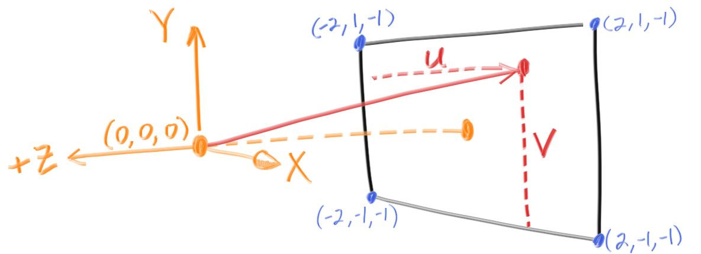

# Ray Tracing In One Weekend
## PPM Example

 การสร้างภาพจากตัวเลขจาก RGB และมีขนาด 3 แถว 2 ชั้น 

## Ray Class
### ray คืออะไร

 ray จะสามารถเขียนเป็นฟังก์ชัน P(t)=A+tb โดน p นั้นเป็นตำแหน่งของ 3D ตามแนวเส้นแบบ 3D แบบเเส้นนี้มันไปทางไหน   
โดนที่เราจะหาจาก A คือจุดกำเนิดของ ray ตัวอย่างใน unity ก็พวก raycast ที่ใช้ตำแหน่งของเมาส์ และ B คือทมิศทางของเส้นว่าวิ่งไปทางไหน  
พารามิเตอร์ T เป็นจำนวนจริง (เป็น double ในโค้ด) ใช้ในการไปจุดต่างๆ การเพื่มค่าลบของ t จะทำให้เราไปที่ไหนก็ได้บนเส้นแต่ว่าเพื่มค่าบวกเราจะไปได้แค่ด้านหน้า A เท่านั้น  

### ส่ง ray เข้าฉากยังไง
#### Camera geometry

ในการทำ Ray Tracing เราจะลองทำสามชั้นต่อไปนี้ 1 คำนวณรังสีจากจุดที่เรื่มต้นไปยังพิกเซล 2 กำหนดว่าของอันไหนสามารถโดน ray ได้บาง 3.คำนวนสีของจุดตัด

โดยที่เราจะทำฟังชั้น ray_color(ray) เพื่อที่จะใช้ในการเช็คสี โดยมันจะคืนค่าสีที่rayยิงไปโดนกลับมา

เราจะสามารถเจอปัญหาในการ debugging จากก่ารใช้รูปสี่เหลี่ยมจัตุรัสได้ เราเลยใช้อันตาส่วนภาพ 16:9 แทน

เรายังต้องตั้งค่าวิวพอร์ตเสมือนที่เราจะส่ง ray เข้าไป อัตราส่วนของวิวพอร์ตควรเท่ากับภาพที่แสดงผลของเราและเราจะกำหนดระยะห่างระหว่างระนาบการฉายภาพกับจุดฉายภาพให้เป็นหนึ่งหน่วย สิ่งนี้เรียกว่า "ทางยาวโฟกัส" เพื่อไม่ให้สับสนกับ "ระยะโฟกัส" ซึ่งเราจะนำเสนอในภายหลัง  กันงงให้นึกถึงกล้องกับกระดาษที่วางอยู่หน้ากล้องและกระดาษจะคือวิวพอร์ต

เราจะใส่ "ตา" (หรือศูนย์กลางของกล้องถ้าคุณนึกถึงกล้อง) ที่ (0,0,0) ผมจะให้แกน y สูงขึ้น และแกน x อยู่ทางขวา เพื่อให้เป็นไปตามธรรมเนียมของระบบพิกัดที่ถนัดขวาแบบ unity และแกน z เชิงลบอยู่ในหน้าจอ ฉันจะสำรวจหน้าจอจากมุมบนซ้ายมือ และใช้เวกเตอร์ออฟเซ็ตสองตัวตามด้านข้างของหน้าจอเพื่อย้ายจุดปลายของรังสีผ่านหน้าจอ

ถ้างงให้ดูตามรูป

#### ฟังชั้นของ ray_color(ray) 

ฟังก์ชัน ray_color(ray) จะผสมสีขาวและสีน้ำเงินเป็นเส้นตรงโดยขึ้นอยู่กับความสูงของค่า y หลังจากปรับขนาดทิศทางของรังสีเป็นความยาวหน่วยจะได้เป็น −1.0 < y < 1.0 เนื่องจากเรากำลังดูความสูง y หลังจากปรับเวกเตอร์ให้เป็นเวกเตอร์หนึ่งหน่วย

จากนั้นฉันก็ใช้เคล็ดลับกราฟิกมาตรฐานในการปรับขนาดเป็นให้ค่ามันอยู่ระหว่าง 0 กับ 1 (0.0 ≤ t ≤ 1.0) เมื่อ t=1 ให้เป็นสีน้ำเงิน เมื่อ t=0 ให้เป็นสีขาว เราค้องการผสมสีเราจะใช้รูปแบบนี้เป็น "การผสมผสานเชิงเส้น" หรือ "การแก้ไขเชิงเส้น" หรือ "lerp" สั้น ๆ ระหว่างสองสิ่ง lerp อยู่ในรูปแบบเสมอ 

blendedValue = (1−t) * startValue + t * endValue

